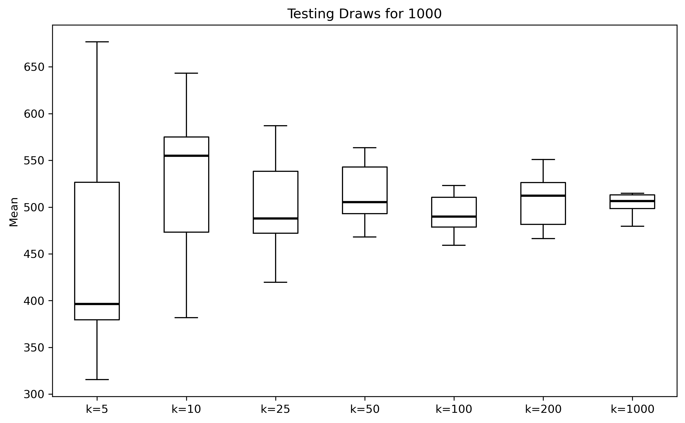

# Law of Large Numbers – Snakemake Pipeline

This pipeline demonstrates the **Law of Large Numbers (LLN)** graphically.

Given a range **1 to n**, we repeatedly sample **k** values and compute the mean. 
As k increases, the sample mean converges to the true mean **(1 + n) / 2**.
The pipeline runs this experiment `repeats` times for each k value and plots the distribution of means as a boxplot.


## Example Output




## Requirements

This pipeline assumes you have the following already installed:

- Python 3.10+
- Snakemake (install via conda):

```bash
conda create -n snakemake -c conda-forge -c bioconda snakemake
conda activate snakemake
conda install numpy
conda install matplotlib
```


## How to Run

```bash
snakemake --cores 4 --configfile config.yaml
```

To change `n`, `k_values`, or `repeats`, edit `config.yaml` before running:

```yaml
n: 1000          # upper bound of range (1 to n), default 1000
repeats: 10      # number of repeated experiments per k, default 10
k_values:        # number of draws per experiment
  - 5
  - 10
  - 25
  - 50
  - 100
  - 200
  - 1000
```


## File Structure

```
.
├── Snakefile
├── config.yaml
├── README.md
├── Example_1000.png
├── scripts/
│   ├── lln_sim.py    # samples k values from [1..n] and saves means
│   └── plot.py       # reads txt files and generates boxplot
├── results/
│   └── n/            # one txt file per k value 
└── plots/
    └── n.png         # final boxplot (will be shown once run, can be seen in the example_n.png. If I provide it in plots dir, snakemake will not run pipeline as result already exist)
```
